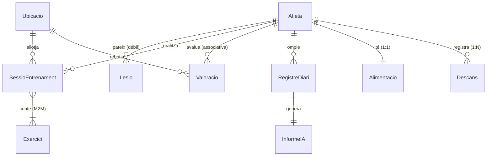

# Documentació d'Arquitectura i Desenvolupament - GoUp AI

Aquest document descriu de forma detallada l'arquitectura, tecnologies, llenguatges i tota la implementació desenvolupada per a la web de gestió del projecte **GoUp AI** (entrega final d'assignatura de Bases de Dades).

---

## 1. Arquitectura i Pila Tecnològica

L'aplicació està estructurada sobre un entorn web clàssic, robust i segur amb un enfocament en l'eficiència a l'hora de gestionar bases de dades massives.

* **Llenguatge de Programació**: **Python 3.13** (desenvolupament de la lògica de negoci, scripts de població i configuració).
* **Framework Backend**: **Django 6.0** sota el patró **MTV** (Model-Template-View):
  * **Model**: Defineix l'esquema relacional traduint classes Python a taules SQL mitjançant el seu ORM (Object-Relational Mapping).
  * **Template**: Presentació visual (HTML/CSS) de cara a l'usuari final.
  * **View**: Controladors de flux de dades que processen les peticions HTTP, interaccionen amb la BD i renderitzen les plantilles.
* **Sistema Gestor de Bases de Dades (SGBD)**: **PostgreSQL (v16)**, allotjat al servidor universitari remot `ubiwan.epsevg.upc.edu` (sota el namespace `practica`).
* **Seguretat (Prevenció d'Injecció SQL)**: S'utilitza de forma estricta l'ORM de Django, el qual parametritza automàticament totes les consultes executades cap a la base de dades. D'aquesta manera es bloca qualsevol intent d'injecció de codi SQL maliciós de forma nativa.
* **Aparença Visual**: Disseny premium de tipus fosc (Dark Slate / Glassmorphism) amb variables CSS personalitzades, efectes translúcids, transicions suaus i un sistema responsiu optimitzat per a escriptoris i dispositius mòbils. Carrega tipografies modernes de Google Fonts (Inter) i icones vectorials netes mitjançant Lucide.

---

## 2. Model de Dades i Entitats Implementades

Per a complir amb les especificacions del projecte (diversitat en relacions, entitats febles, N:M, relacions 1:1 i regles de negoci complexes), hem implementat un subconjunt format per **9 entitats connectades** del diagrama UML:

1. **`Atleta`** (Entitat Principal): Representa l'atleta del sistema. Clau primària (`dni_atleta`) i camps únics de contacte (`correu`, `numero_telefon`).
2. **`Lesio`** (Entitat Feble d'Atleta): Clau combinada única formada per `(atleta_id, id_lesio)`. Guarda registre de molèsties físiques i el seu estat.
3. **`Ubicacio`** (Lloc físic): Gimnasos o espais on els atletes executen les seves sessions d'entrenament.
4. **`SessioEntrenament`** (Sessió de treball): Relaciona l'atleta amb el lloc i la data de realització. Manté una relació N:M amb els exercicis.
5. **`Valoracio`** (Classe Associativa N:M): Opinió puntuada de 0 a 5 estrelles que un atleta fa sobre una ubicació determinada.
6. **`RegistreDiari`** (Sensacions diàries): Registre diari on l'atleta anota l'adherència a la dieta, son, estrès i energia.
7. **`InformeIA`** (Classe 1:1 associada): Consells personalitzats generats pel motor d'IA en base a les sensacions del registre diari.
8. **`Alimentacio`** (Classe 1:1 d'Atleta): Dieta personalitzada de l'atleta amb objectius calòrics i de macronutrients (proteïnes, carbohidrats, greixos) i suplementació de format text lliure.
9. **`Descans`** (Registre de son): Seguiment diari del son de l'atleta dividit per fases (Despert, REM, Core, Deep), duració total calculada i variabilitat de freqüència cardíaca (HRV).

---

## 3. Regles de Negoci i Integritat Implementades

S'han codificat diversos mecanismes de validació i trigger a nivell d'aplicació per assegurar la coherència lògica de la BD:

* **RI-1: Control de Valoracions Fantasma (Valoracio)**:
  * *Comportament*: Un atleta només pot emetre una opinió/puntuació sobre una ubicació si té registrada almenys una sessió d'entrenament física en aquella ubicació.
  * *Implementació*: Al mètode `clean()` de [Valoracio](file:///Users/hugohf05/Q6/DABD/LAB/proyecte/goup_ai/core/models.py#L90), comprovem l'existència de sessions prèvies. Si no n'hi ha, la transacció és cancel·lada i es llança una excepció visual.
* **RI-2: Sincronització Estat Atleta-Lesió (Lesio)**:
  * *Comportament*: Si un atleta té qualsevol lesió en estat `'ACTIVA'`, el seu estat global d'atleta canvia immediatament a `'LESIONAT'`. En el moment que es resol l'última lesió activa, l'atleta torna automàticament a estar en estat `'ACTIU'`.
  * *Implementació*: Al mètode `save()` de [Lesio](file:///Users/hugohf05/Q6/DABD/LAB/proyecte/goup_ai/core/models.py#L191), s'aplica aquest disparador actiu actualitzant de forma directa el model d'Atleta.
* **RI-3: Coherència i càlcul de la Durada del Descans (Descans)**:
  * *Comportament*: La durada total de la sessió de son (en minuts) ha de correspondre exactament a la suma de les 4 fases detallades (Despert + REM + Core + Deep).
  * *Implementació*: Al mètode `clean()` de [Descans](file:///Users/hugohf05/Q6/DABD/LAB/proyecte/goup_ai/core/models.py#L246), es realitza la validació abans de guardar. Paral·lelament, a nivell de front-end, s'ha programat codi JavaScript dinàmic per autocalcular i bloquejar com a readonly el camp de duració.

---

## 4. Estructura de Codi Desenvolupada

A continuació, es resumeix el treball implementat fitxer a fitxer:

### A. Configuració i Base de Datos
* **[models.py](file:///Users/hugohf05/Q6/DABD/LAB/proyecte/goup_ai/core/models.py)**: Declaració d'atributs, enums, rangs lògics i les funcions `clean()` / `save()` descrites en el punt 3, incloent-hi els nous models `Alimentacio` i `Descans`.
* **[esquema_relacional.sql](file:///Users/hugohf05/Q6/DABD/LAB/proyecte/esquema_relacional.sql)**: Eliminació de la restricció incorrecta `CHECK (composicio_corporal > 0)` que donava error de tipus en PostgreSQL.
* **Migracions**: Aplicat el nou camp `id_lesio`, les noves taules `core_alimentacio` i `core_descans`, i les corresponents claus a PostgreSQL a Ubiwan.

### B. Poblar la Base de Datos
* **[generar_dades.py](file:///Users/hugohf05/Q6/DABD/LAB/proyecte/goup_ai/core/management/commands/generar_dades.py)**: Totalment redissenyat per a:
  * Generar identificadors `id_lesio` incremental de manera independent per cada atleta.
  * Enllaçar exercicis reals creats pel propi atleta a les seves sessions d'entrenament (entre 2 i 5 per sessió).
  * Crear opinions i vots reals a `core_valoracio` basats en l'historial de sessions.
  * Afegir l'argument `--fast` per poder regenerar una base de dades reduïda de desenvolupament en només 15 segons.

### C. Formulari i Vistes CRUD (Backend Django)
* **[forms.py](file:///Users/hugohf05/Q6/DABD/LAB/proyecte/goup_ai/core/forms.py)**: Defineix els formularis enllaçats als models amb classes CSS de control i widgets de data HTML5.
  * *Optimització de rendiment*: En el formulari de sessions d'entrenament, limitem els exercicis seleccionables als creats per l'atleta escollit.
  * *Formulari de Registre Diari*: S'incorpora `RegistreDiariForm` per permetre la introducció de mètriques de son, energia, estrès, adaptabilitat a la dieta i comentaris generals.
  * *Formulari de Dieta (`AlimentacioForm`)*: Permet editar de forma senzilla les macros, tipus de dieta i la suplementació (amb text lliure).
  * *Formulari de Descans (`DescansForm`)*: Gestiona els camps de son de l'atleta, incloent widgets numèrics de control amb classes per a la suma en temps real amb JS.
* **[views.py](file:///Users/hugohf05/Q6/DABD/LAB/proyecte/goup_ai/core/views.py)**: Class-Based Views per a listats, edició, borrat, creació i detalls dels atletes, lesions, sessions, valoracions, dieta i descansos.
  * *ID de lesió automàtic*: En la creació de lesions, el sistema obté el màxim `id_lesio` de l'atleta a la BD i s'incrementa en 1 de forma automàtica.
  * *Generació Automàtica d'Informe IA*: A la vista `RegistreDiariCreateView`, en desar les sensacions diàries, un algorisme de recomanacions evalua l'adherència a la dieta, son, estrès i energia, i genera de forma immediata un registre d'**`InformeIA`**.
  * *Gestió Integrada de Dieta*: Implementació de `AlimentacioCreateView` i `AlimentacioUpdateView` integrades amb el flux de l'atleta.
  * *Gestió del Descans*: Vistes per a la gestió de son (`DescansListView` amb cercador per nom/DNI de l'atleta, `DescansCreateView`, `DescansUpdateView` i `DescansDeleteView`).
  * *Buscadors Autocomplete AJAX*: Vistes especialitzades (`AtletaAutocompleteView` i `ExerciciAutocompleteView`) optimitzades per retornar llistes JSON de resultats de cerca de forma asíncrona, vitals per al rendiment a causa de l'alt volum d'exercicis a la base de dades.
  * *Creació d'Ubicacions*: Afegeix flux de creació mitjançant `UbicacioCreateView` per permetre als atletes registrar nous espais d'entrenament.

### D. Interfície d'Usuari (Templates i Estils)
* **[urls.py](file:///Users/hugohf05/Q6/DABD/LAB/proyecte/goup_ai/core/urls.py)**: Enrutament de totes les accions web, incloent les noves rutes `/atletes/<dni>/registre-diari/nou/`, `/informe-ia/<registre_id>/` i les noves rutes CRUD per a descansos i dieta.
* **[styles.css](file:///Users/hugohf05/Q6/DABD/LAB/proyecte/goup_ai/core/static/core/styles.css)**: Paleta de color fosca responsiva amb estil fosc elegant, barra lateral, indicadors d'estat i disseny premium. Configurat disseny de dues columnes en paral·lel per a la fitxa de l'atleta i la seva dieta.
* **HTML Templates**:
  * [base.html](file:///Users/hugohf05/Q6/DABD/LAB/proyecte/goup_ai/core/templates/core/base.html): Estructura compartida, sidebar, i integració de la nova pestanya per a Descansos.
  * [dashboard.html](file:///Users/hugohf05/Q6/DABD/LAB/proyecte/goup_ai/core/templates/core/dashboard.html): Mètriques agregades de sessions, opinions, lesions actives i llista d'activitat recent.
  * [atleta_detail.html](file:///Users/hugohf05/Q6/DABD/LAB/proyecte/goup_ai/core/templates/core/atleta_detail.html): S'hi afegeix el panell **"Alimentació"** a la dreta del perfil de l'atleta, en format paral·lel mitjançant CSS Grid. A sota, es manté l'historial de Registres Diaris i Consells IA.
  * [atleta_form.html](file:///Users/hugohf05/Q6/DABD/LAB/proyecte/goup_ai/core/templates/core/atleta_form.html): Pantalla de creació/edició de l'atleta que inclou un formulari paral·lel per configurar o editar la seva alimentació.
  * [descans_list.html](file:///Users/hugohf05/Q6/DABD/LAB/proyecte/goup_ai/core/templates/core/descans_list.html): Pantalla de descansos amb barra de cerca per atleta (nom o DNI), acció d'afegir i botons d'edició/eliminació en disseny de taula elegant de estil fosc.
  * [descans_form.html](file:///Users/hugohf05/Q6/DABD/LAB/proyecte/goup_ai/core/templates/core/descans_form.html): Formulari de descans amb script JS que calcula dinàmicament la durada sumant les fases en temps real (`keyup`/`change` en inputs de tipus `.rests-input`).
  * *Integració Select2 AJAX*: Incorporat als formularis un sistema de cerca dinàmica mitjançant el component Select2 en mode AJAX per millorar radicalment el temps de càrrega (especialment en exercicis, evitant descarregar els 1400+ registres). Implementa maneig d'errors intel·ligent, ignorant cancel·lacions (`abort`) pròpies d'una escriptura ràpida.
  * [ubicacio_list.html](file:///Users/hugohf05/Q6/DABD/LAB/proyecte/goup_ai/core/templates/core/ubicacio_list.html) i [ubicacio_form.html](file:///Users/hugohf05/Q6/DABD/LAB/proyecte/goup_ai/core/templates/core/ubicacio_form.html): Funcionalitat completa afegida a la interfície per permetre afegir i llistar noves ubicacions.
