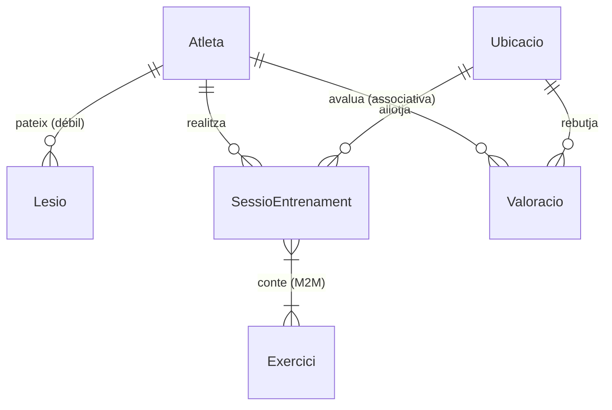

# Documentació d'Arquitectura i Desenvolupament - GoUp AI

Aquest document descriu de forma detallada l'arquitectura, tecnologies, llenguatges i tota la implementació inicial desenvolupada per a la web de gestió del projecte **GoUp AI** (entrega final d'assignatura de Bases de Dades).

---

## 1. Arquitectura i Pila Tecnològica

L'aplicació està estructurada sobre un entorn web clàssic, robust i segur amb un enfocament en l'eficiència a l'hora de gestionar bases de dades massives.

* **Llenguatge de Programació**: **Python 3.13** (desenvolupament de la lògica de negoci, scripts de població i configuració).
* **Framework Backend**: **Django 6.0** sota el patró **MTV** (Model-Template-View):
  * **Model**: Defineix l'esquema relacional traduint classes Python a taules SQL mitjançant el seu ORM (Object-Relational Mapping).
  * **Template**: Presentació visual (HTML/CSS) de cara a l'usuari final.
  * **View**: Controladors de flux de dades que processen les peticions HTTP, interaccionen amb la BD i renderitzen les plantilles.
* **Sistema Gestor de Bases de Dades (SGBD)**: **PostgreSQL (v16)**, allotjat al servidor universitari remot `ubiwan.epsevg.upc.edu` (sota el namespace `practica`).
* **Seguretat (Prevenció d'Injecció SQL)**: S'utilitza de forma estricta l'ORM de Django, el qual parametritza automàticament totes les consultes executades cap a la base de dades. D'aquesta manera es bloca qualsevol intent d'injecció de codi SQL maliciós de forma nativa.
* **Aparença Visual**: Disseny premium de tipus fosc (Dark Slate) amb variables CSS personalitzades, efecte de vidre esmerilat (Glassmorphism), transicions suaus i un sistema responsiu optimitzat tant per a escriptoris com dispositius mòbils. Carrega tipografies modernes de Google Fonts (Inter) i icones vectorials netes mitjançant Lucide.

---

## 2. Model de Dades i Entitats Implementades

Per a complir amb les especificacions del professor (diversitat en relacions, entitats febles, N:M i regles de negoci complexes), hem implementat un subconjunt format per **5 entitats connectades** del diagrama UML:

1. **`Atleta`** (Entitat Principal): Representa l'usuari del sistema. Clau primària (`dni_atleta`) i camps únics de contacte (`correu`, `numero_telefon`).
2. **`Lesio`** (Entitat Feble d'Atleta): Clave combinada única formada per `(atleta_id, id_lesio)`. Guarda registre de molèsties físiques i el seu estat.
3. **`Ubicacio`** (Lloc físic): Gimnasos o espais on els atletes executen les seves sessions d'entrenament.
4. **`SessioEntrenament`** (Sessió de treball): Relaciona l'atleta amb el lloc i la data de realització. Manté una relació N:M amb els exercicis.
5. **`Valoracio`** (Classe Associativa N:M): Opinió puntuada de 0 a 5 estrelles que un atleta fa sobre una ubicació determinada.

---

## 3. Regles de Negoci i Integritat Implementades

S'han codificat dos mecanismes de validació i trigger a nivell d'aplicació per assegurar la coherència lògica de la BD:

* **RI-1: Control de Valoracions Fantasma (Valoracio)**:
  * *Comportament*: Un atleta només pot emetre una opinió/puntuació sobre una ubicació si té registrada almenys una sessió d'entrenament física en aquella ubicació.
  * *Implementació*: Al mètode `clean()` de [Valoracio](file:///Users/hugohf05/Q6/DABD/LAB/proyecte/goup_ai/core/models.py#L90), comprovem l'existència de sessions prèvies. Si no n'hi ha, la transacció és cancel·lada i es llança una excepció visual.
* **RI-2: Sincronització Estat Atleta-Lesió (Lesio)**:
  * *Comportament*: Si un atleta té qualsevol lesió en estat `'ACTIVA'`, el seu estat global d'atleta canvia immediatament a `'LESIONAT'`. En el moment que es resol l'última lesió activa, l'atleta torna automàticament a estar en estat `'ACTIU'`.
  * *Implementació*: Al mètode `save()` de [Lesio](file:///Users/hugohf05/Q6/DABD/LAB/proyecte/goup_ai/core/models.py#L191), s'aplica aquest disparador actiu actualitzant de forma directa el model d'Atleta.

---

## 4. Estructura de Codi Desenvolupada

A continuació, es resumeix el treball implementat fitxer a fitxer:

### A. Configuració i Base de Datos
* **[models.py](file:///Users/hugohf05/Q6/DABD/LAB/proyecte/goup_ai/core/models.py)**: Declaració d'atributs, enums, rangs lògics i les funcions `clean()` / `save()` descrites en el punt 3.
* **[esquema_relacional.sql](file:///Users/hugohf05/Q6/DABD/LAB/proyecte/esquema_relacional.sql)**: Eliminació de la restricció incorrecta `CHECK (composicio_corporal > 0)` que donava error de tipus en PostgreSQL.
* **Migracions**: Aplicat el nou camp `id_lesio` i la clau única a PostgreSQL en Ubiwan.

### B. Poblar la Base de Datos
* **[generar_dades.py](file:///Users/hugohf05/Q6/DABD/LAB/proyecte/goup_ai/core/management/commands/generar_dades.py)**: Totalment redissenyat per a:
  * Generar identificadors `id_lesio` incremental de manera independent per cada atleta.
  * Enllaçar exercicis reals creats pel propi atleta a les seves sessions d'entrenament (entre 2 i 5 per sessió).
  * Crear opinions i vots reals a `core_valoracio` basats en l'historial de sessions (resolent el problema de 0 valoracions).
  * Afegir l'argument `--fast` per poder regenerar una base de dades reduïda de desenvolupament en només 15 segons.

### C. Formulari i Vistes CRUD (Backend Django)
* **[forms.py](file:///Users/hugohf05/Q6/DABD/LAB/proyecte/goup_ai/core/forms.py)**: Defineix els formularis enllaçats als models amb classes CSS de control i widgets de data HTML5.
  * *Optimització de rendiment*: En el formulari de sessions d'entrenament, limitem els exercicis seleccionables als creats per l'atleta escollit (o als 100 primers si es crea en blanc). Això evita carregar 200.000 files a la vegada i col·lapsar la memòria del navegador.
* **[views.py](file:///Users/hugohf05/Q6/DABD/LAB/proyecte/goup_ai/core/views.py)**: Class-Based Views per a listats, edició, borrat, creació i detalls dels atletes, lesions, sessions i valoracions.
  * *ID de lesió automàtic*: En la creació de lesions, el sistema obté automàticament el màxim `id_lesio` de l'atleta seleccionat en base de dades i s'incrementa en 1, de manera que l'atleta no ha d'introduir-lo a mà.

### D. Interfície d'Usuari (Templates i Estils)
* **[urls.py](file:///Users/hugohf05/Q6/DABD/LAB/proyecte/goup_ai/core/urls.py)**: Enrutament de totes les accions web de l'aplicació.
* **[styles.css](file:///Users/hugohf05/Q6/DABD/LAB/proyecte/goup_ai/core/static/core/styles.css)**: Paleta de color fosca responsiva amb estil fosc elegant, barra lateral, indicadors d'estat i disseny premium.
* **HTML Templates**:
  * [base.html](file:///Users/hugohf05/Q6/DABD/LAB/proyecte/goup_ai/core/templates/core/base.html): Estructura compartida, sidebar i CDNs.
  * [dashboard.html](file:///Users/hugohf05/Q6/DABD/LAB/proyecte/goup_ai/core/templates/core/dashboard.html): Mètriques agregades de sessions, opinions, lesions actives i llista d'activitat recent.
  * Vistes de llistat i perfils de detall d'atletes amb tot el seu històric.
  * Formulari de valoració de llocs d'entrenament amb missatges d'explicació de les validacions (RI-1).
